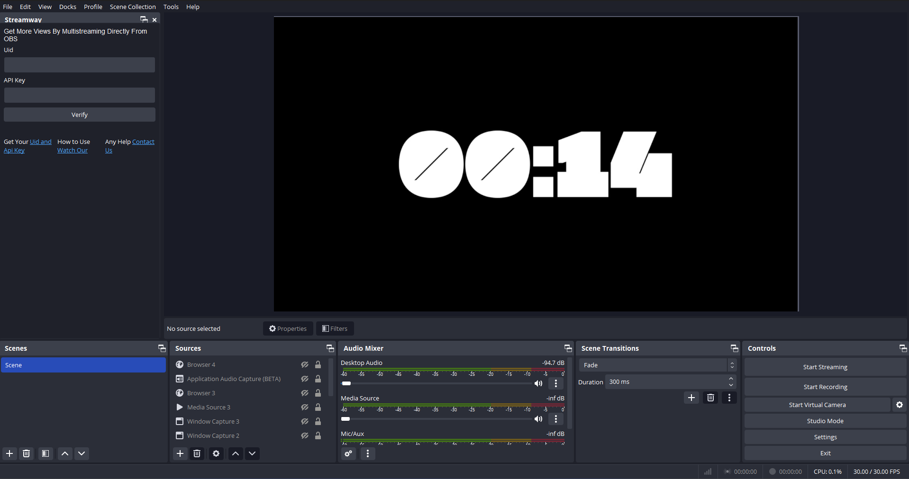
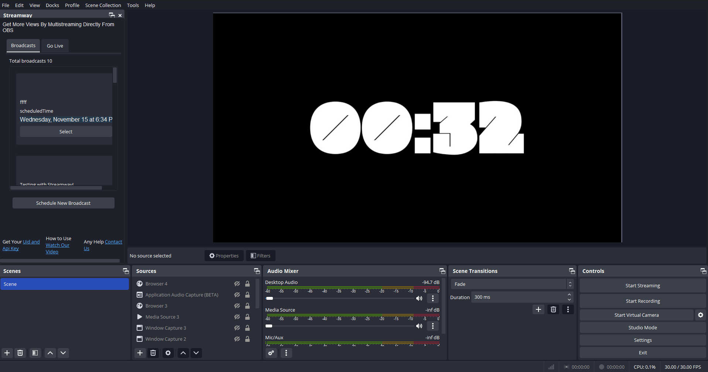
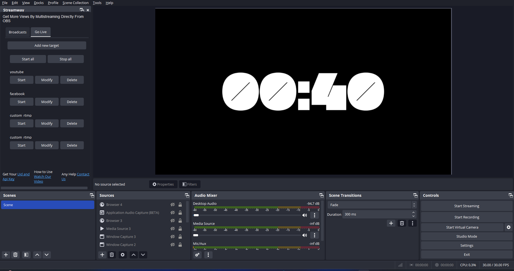

# ! Warning still in development

# [Homepage / Link](https://github.com/streamwayin/Streamway_obs_multi_rtmp_plugin)

## Login 

 

## Select Broadcast

## Go Live 

## Build

Windows
> .github\scripts\Build-Windows.ps1

macOS
> .github/scripts/build-macos.zsh

# Credit -> obs-multi-rtmp plugin by sorayuki
This plugin is an extention of obs-multi-rtmp and it intents to empower users to multistream from within OBS itself.
Purpose of plugin is to let user schedule event from within the OBS studio itself rathar than opening multiple tabs of diffrent social platforms like youtube and facebook and manually copy pasting the keys etc. 
https://github.com/sorayuki/obs-multi-rtmp

# Contributions and suggestions in any form are always welcome 😊

